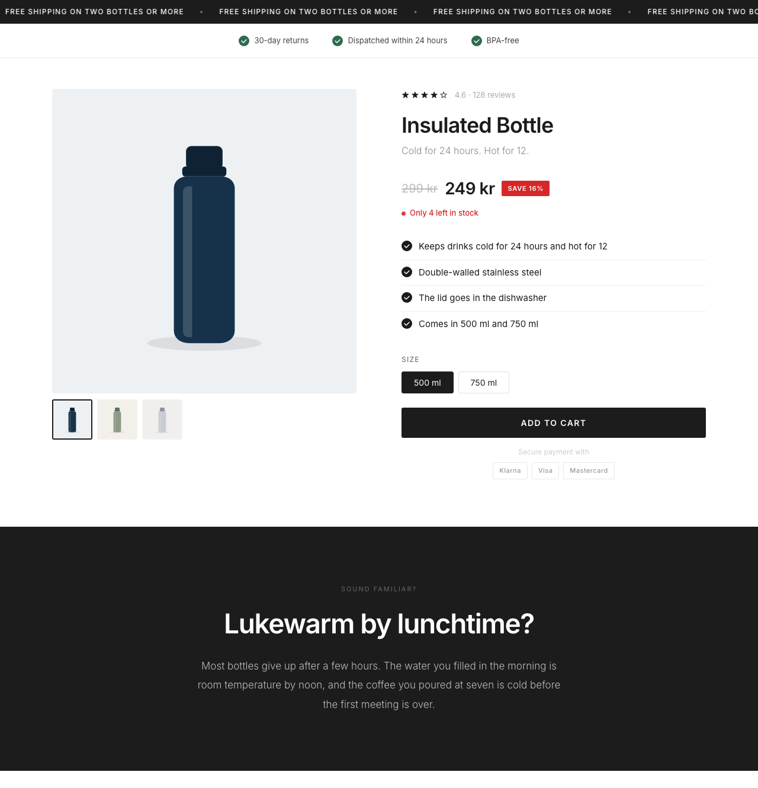
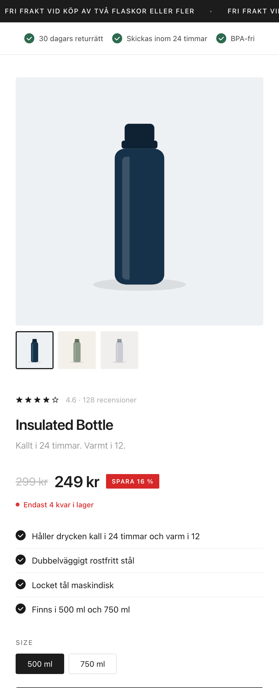

# Shopify landing page generator

Turns a short brief with copy and images into a product landing page for a Shopify store, previews it locally, and publishes it to a theme through the Admin API.

<p align="center">
  
</p>

The product, the store and the figures in the screenshots are made up. The images are placeholder drawings.

## Why I built it

I ran a D2C store in five European markets and built the product pages myself. A landing page for a new product or a new market had the same structure every time: an offer line, a gallery, the price, a few bullet points, the problem, the benefits, an FAQ. Only the copy and the images changed.

This tool takes the part that changes as a file and produces the page. The copy can be written by a person or drafted with an AI model. The tool does not care which.

## What it does

```shell
npm install
npm run preview
```

`npm run preview` builds the example page and writes `out/preview.html`, which opens in any browser. No store is needed for that.

| Command | What it does |
|---|---|
| `npm run lp -- preview <brief.json>` | Builds the page and renders it locally with made-up product data |
| `npm run lp -- build <brief.json>` | Writes the Liquid template to `out/theme/templates/` |
| `npm run lp -- check` | Signs in to the store and lists its themes and the app's access. Changes nothing. |
| `npm run lp -- publish <brief.json> --theme <id>` | Uploads the template to a theme |

A brief looks like [`examples/insulated-bottle.en.json`](examples/insulated-bottle.en.json). The same page in Swedish is in [`examples/insulated-bottle.sv.json`](examples/insulated-bottle.sv.json).

## What comes from the brief and what comes from Shopify

| On the page | Source |
|---|---|
| Offer line, subtitle, bullet points, problem, benefits, FAQ | The brief |
| Product title, price, compare-at price, variants | Shopify |
| "Save 16%" | Calculated by Shopify from the two prices, rounded down |
| "Only 4 left in stock" | The variant's real inventory. Shown only when Shopify tracks the stock, overselling is off, and the quantity is at or below the threshold in the brief. |
| Star rating and number of reviews | The product's review metafields, which review apps fill in. Hidden when there are no reviews. |
| Review cards | The brief. They are optional and must be real reviews. |

The first version took the stock level, the rating and a customer count as typed text. That makes it too easy to publish numbers that are not true, so those fields are gone, and a brief that still contains them is rejected with an explanation.

Everything from the brief is escaped. Markup or Liquid code in the copy shows up as plain text on the page and is never run.

## Publishing without surprises

Publishing to a store with customers on it should not be able to break a product page by accident. The steps are ordered for that:

1. **Everything is checked first.** The brief is validated, and the theme and the product are looked up before anything is written.
2. **Uploading changes nothing customers see.** A new template is only used by a product that is switched to it. After the upload the tool prints a preview link.
3. **Switching the product is a separate choice.** It happens only with `--assign`.
4. **An existing template is not replaced** unless `--overwrite` is given.
5. **`--dry-run` shows what would happen** and writes nothing.

`--theme` takes a theme id, or `live` for the published theme. Uploading to an unpublished copy of the theme first is the careful way.

## Markets

The fixed interface text, such as the add-to-cart button and the FAQ heading, exists for the five markets, in Swedish, Finnish, Norwegian, Danish and Dutch, and in English. The brief chooses one with `"locale"`.

<p align="center">
  
</p>

## Connecting a store

Copy `.env.example` to `.env` and fill in the store address and the app's client id and secret. The app needs the access scopes `read_themes`, `write_themes`, `read_products` and `write_products`.

Shopify only lets an app write theme files if it also has an exemption for that, which is requested from Shopify. Without it, `publish` is refused by Shopify. `build` still works, and its output is laid out as a theme folder, so the template can be pushed with the Shopify CLI:

```shell
shopify theme push --path out/theme --only templates/product.lp-insulated-bottle.liquid --theme <id>
```

## How it is tested

```shell
npm run lint
npm test
```

There are 35 tests. They cover:

- **The brief:** required fields, typos, removed fields, and template names that try to leave the templates folder.
- **The page:** escaping, the low-stock line at different inventory levels, the rating with and without reviews, the saving badge, empty sections, every market.
- **Publishing:** the order of the steps, that nothing is written when a check fails, and that a dry run never writes.
- **The API client:** the requests it sends, and that the app secret is only ever sent to a Shopify store address.

The page tests render the template with a local Liquid engine. The publishing tests use a stand-in for the store. The GraphQL operations are checked against Shopify's Admin API schema.

I also checked a built page in a Shopify development store:

- **Shopify's own linter, Theme Check, finds no errors in the template.** Its first run led to two fixes: images now have dimensions, and the page uses system fonts instead of loading fonts from a third party.
- **Shopify accepted the template**, uploaded with the Shopify CLI to the store's theme. No other theme file was changed.
- **The page rendered for a real product**, with the store's own title and price format, and add-to-cart put the product in the cart.

## Limitations

- **The `publish` command has not been run against a store.** It needs an app with Shopify's exemption for writing theme files, which I do not have. The store check above used the Shopify CLI for the upload.
- **The low-stock line and the rating have only been tested locally.** The product in the development store had neither low stock nor reviews, so those lines were correctly left out there, but never shown.
- **The preview is an approximation.** It uses a local Liquid engine with stand-ins for Shopify's own features, so it shows layout and copy but is not an exact copy of what Shopify renders.
- **The page stands on its own.** It does not use the theme's header, footer or cart drawer, and add-to-cart goes to the cart page.
- **Only the product's first option can be chosen**, for example size but not size and colour.
- **The stock line belongs to the first variant.** It is hidden when the customer picks another one.
- **Reviews in the brief are taken on trust.** The tool cannot check that they are real.

## What is in the repository

| Path | What it is |
|---|---|
| [`src/template.js`](src/template.js) | Builds the Liquid template from a brief |
| [`src/validate.js`](src/validate.js) | Checks a brief and explains what is wrong |
| [`src/locales.js`](src/locales.js) | Interface text per market |
| [`src/publish.js`](src/publish.js) | The publishing steps and their safety checks |
| [`src/shopify.js`](src/shopify.js) | Client for the Shopify Admin GraphQL API |
| [`src/preview.js`](src/preview.js) | Local rendering without a store |
| [`src/page.css`](src/page.css), [`src/page.client.js`](src/page.client.js) | The page's styles and its script |
| [`examples/`](examples) | Two briefs, made-up product data and placeholder images |

## How it was built

I am not a software engineer by trade. I wrote this with [Claude Code](https://claude.com/claude-code): I decided what the tool should do and what a landing page needs, and the AI wrote most of the code.

## License

[MIT](LICENSE)
